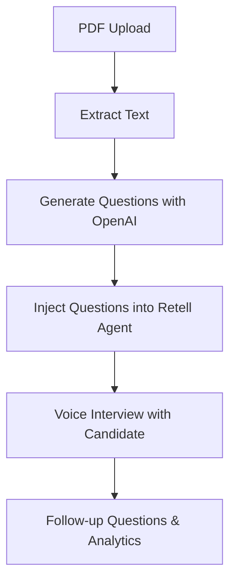

# Retell AI Interview Agent Setup Guide

This guide explains how to set up a Retell AI agent that can:
- Convert PDF documents into structured interview questions
- Use those questions in a voice-based interview
- Ask follow-up questions and provide a natural, professional interview experience

---

## 1. System Overview



---

## 2. PDF to Questions Pipeline

### a. PDF Upload & Parsing
- Use a PDF parsing library (e.g., LangChain's `PDFLoader` or `pdf-parse`) to extract text from the uploaded PDF.
- Example (Node.js):

```js
const loader = new PDFLoader(file);
const docs = await loader.load();
const fullText = docs.map(doc => doc.pageContent).join("\n");
```

### b. Question Generation (OpenAI)
- Send the extracted text as `context` to an OpenAI model (e.g., GPT-4) with a prompt to generate interview questions.
- Example prompt:

```
Imagine you are an interviewer specialized in designing interview questions to help hiring managers find candidates with strong technical expertise and project experience.

Interview Title: {{name}}
Interview Objective: {{objective}}
Number of questions to be generated: {{number}}

Follow these guidelines:
- Focus on technical knowledge and project experience
- Include problem-solving and soft skills questions
- Keep each question concise (≤30 words)

Use the following context to generate the questions:
{{context}}

Output a JSON object with keys 'questions' (array of {question: string}) and 'description' (≤50 words, second-person, for the candidate).
```

- Parse the OpenAI response and store the questions for the interview.

---

## 3. Retell Agent Prompt Template

Use a dynamic prompt template for your Retell agent. Example:

```
You are an interviewer who is an expert in asking follow up questions to uncover deeper insights. You have to keep the interview for {{mins}} or short.

The name of the person you are interviewing is {{name}}.
The interview objective is {{objective}}.

These are some of the questions you can ask:
{{questions}}

Once you ask a question, make sure you ask a follow up question on it.

Guidelines:
- Professional yet friendly tone
- Ask precise, open-ended questions (≤30 words)
- Do not repeat questions
- Stay on topic
- Use the candidate's name if provided
```

---

## 4. Dynamic Variable Injection

When creating a call with Retell, inject the following variables:
- `{{mins}}` — Interview duration
- `{{name}}` — Candidate's name
- `{{objective}}` — Interview objective
- `{{questions}}` — JSON/stringified list of generated questions

Example (Retell SDK):

```js
await retellClient.call.createWebCall({
  agent_id: interviewer.agent_id,
  retell_llm_dynamic_variables: {
    mins: "30",
    name: "Alex",
    objective: "Assess backend engineering skills",
    questions: JSON.stringify(generatedQuestions)
  }
});
```

---

## 5. Interview Flow

1. **Greet the candidate** using their name
2. **Explain the interview objective**
3. **Ask questions** from the generated list
4. **Generate follow-up questions** based on responses
5. **Maintain a professional, conversational flow**
6. **Respect the interview duration**

---

## 6. Example Agent Conversation

**Agent**: "Hello Alex! I'm here to conduct your Backend Engineering interview. Our objective is to assess your experience with scalable systems. Let's start with this: Can you describe a challenging backend project you've worked on?"

**Candidate**: *Provides response*

**Agent**: "That's interesting! What specific challenges did you face, and how did you overcome them?"

**Agent**: "Now, let's move to our next topic. How do you ensure database reliability in your projects?"

---

## 7. API Endpoints (Example)

- `/api/parse-pdf` — Accepts PDF, returns extracted text
- `/api/generate-interview-questions` — Accepts context, returns questions
- `/api/register-call` — Registers a Retell call with dynamic variables

---

## 8. Best Practices

- **Keep prompts concise and clear**
- **Validate all dynamic variables as strings** (Retell requirement)
- **Test agent responses** with different PDF contexts
- **Iterate on prompt design** for best candidate experience

---

## 9. References
- [Retell AI Documentation](https://docs.retellai.com/build/dynamic-variables)
- [LangChain PDFLoader](https://js.langchain.com/docs/modules/data_connection/document_loaders/integrations/pdf)
- [OpenAI API Docs](https://platform.openai.com/docs/api-reference/introduction)

---

## 10. Quick Checklist

- [ ] PDF parsing implemented
- [ ] OpenAI question generation working
- [ ] Retell agent prompt template set up
- [ ] Dynamic variables injected on call creation
- [ ] End-to-end test with real PDF and candidate

---

**This guide can be adapted for any project needing automated, voice-based interviews from document content.** 
